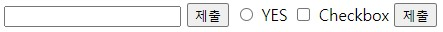

# 폼과 유효성 검사
## Form
웹 페이지에서 사용자가 입력한 데이터를 서버로 전송할 수 있다.
```
<form action="" method="">
    <input type="text" name="test"> <br>
    <input type="submit">
    <input type="radio" id="radio" value="y" name="Question">
    <label for="radio">YES</label>
    <input type="checkbox" id="checkbox"> 
    <label for="checkbox">Checkbox</label>
    <button type="submit" id="submit">
    <label for="submmit">제출</label>
</form>
```


### form
+ **action** : 데이터를 받아서 보낼 url 주소
+ **method** : 데이터를 어떤 방식으로 보낼지 정함
ex) GET, POST, PUT ...

### label
라벨을 눌렀을 때 해당하는 위젯을 활성화

### input
+ **type**은 입력방식을 결정
ex) button, checkbox, date, email, radio, password ...


## 유효성검사
+ 서버로 데이터를 제출하기 전, 포함되어야 할 정보들이 올바른 형식이고, 입력조건에 맞게 잘 입력되었는지 확인하는 것
+ 데이터가 서버 또는 데이터베이스에 저장되기 전 해당데이터를 검증하는 작업
+ 클라이언트 브라우저에서 수행되는 유효성 검사를 **클라이언트 측 유효성 검사**, 서버에서 수행되는 유효성 검사를 **서버 측 유효성 검사**라 한다.

### 유효성검사가 필요한 이유
+ 올바른 형식으로 작성된 올바른 데이터 필요
+ 사용자의 데이터 보호
+ 악의적인 사용자로부터 보호

### HTML 검증 속성, 이벤트
+ required : 양식을 제출하기 전에 양식 필드를 채워야 하는지 여부를 지정, 데이터가 아무것도 채워져 있지 않을때 submit을 막음
+ minlength & maxlength : 텍스트 데이터(문자열)의 최소 및 최대 길이를 지정
+ min & max : 숫자 입력 유형의 최소값 및 최대값 지정
+ type : 데이터가 숫자, 이메일 주소 또는 기타 특정 유형 여부 지정
+ pattern : 입력된 데이터가 따라야 하는 패턴을 정의하는 정규 표현식(regular expression) 지정, 정규 표현식에 부합하지 않으면 submit을 막음
+ oninvalid 이벤트 : 'required'와 'pattern' 속성에 부합하지 않으면 해당 스크립트가 실행